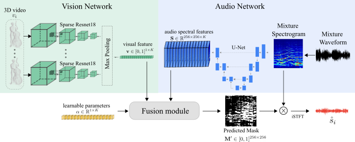

# Music source separation conditioned on 3D point clouds

[Paper](https://arxiv.org/abs/2102.02028) by Francesc Lluís, Vasileios Chatziioannou, Alex Hofmann

Listen to examples in this [video](https://youtu.be/O3IjL8oDAlg)

## Abstract
Recently, significant progress has been made in audio source separation by the application of deep learning techniques. Current methods that combine both audio and visual information use 2D representations such as images to guide the separation process. However, in order to (re)-create acoustically correct scenes for 3D virtual/augmented reality applications from recordings of real music ensembles, detailed information about each sound source in the 3D environment is required. This demand, together with the proliferation of 3D visual acquisition systems like LiDAR or rgb-depth cameras, stimulates the creation of models that can guide the audio separation using 3D visual information. This paper proposes a multi-modal deep learning model to perform music source separation conditioned on 3D point clouds of music performance recordings. This model extracts visual features using 3D sparse convolutions, while audio features are extracted using dense convolutions. A fusion module combines the extracted features to finally perform the audio source separation. It is shown, that the presented model can distinguish the musical instruments from a single 3D point cloud frame, and perform source separation qualitatively similar to a reference case, where manually assigned instrument labels are provided.



## Installation
For installation instructions, please see [INSTALL.md](INSTALL.md).

## Dataset
1. Download 'cello', 'doublebass', 'guitar', 'saxophone' and 'violin' audios from [MUSIC dataset](https://github.com/roudimit/MUSIC_dataset) and [SOLOS dataset](https://github.com/JuanFMontesinos/Solos).
Extract mono waveforms at 11025Hz.

2. Download [The 3D-video Point Cloud Musicians Dataset](https://zenodo.org/record/4812952).

3. Create training/validation/test index files.

    a. Set the following directory structure:
    ```
    data
    ├── audio
    |   ├── cello
    │   |   ├── 0jSLgzeFmao.mp3
    │   |   ├── ...
    │   ├── doublebass
    │   |   ├── 1oXh85Qjkf8.mp3
    │   |   ├── ...
    │   ├── ...
    |
    └── frames
    |   ├── cello
    │   |   ├── person_1
    │   |   |   ├── 00000.ply
    │   |   |   ├── ...
    │   |   ├── ...
    │   ├── doublebass
    │   |   ├── person_1
    │   |   |   ├── 00000.ply
    │   |   |   ├── ...
    │   |   ├── ...
    │   ├── ...
    ```

    b. Make training/validation/test index files by running:
    ```
    python scripts/create_index_files.py
    ```
    It will create index files ```train.csv```/```val.csv```/```test.csv``` with the following format:
    ```
    ./data/audio/cello/0jSLgzeFmao.mp3,./data/frames/cello/person_1,771
    ./data/audio/doublebass/1oXh85Qjkf8.mp3,./data/frames/doublebass/person_5,740
    ```
    For each row, it stores the information: ```AUDIO_PATH,FRAMES_PATH,NUMBER_FRAMES```


## Training

1. a) Download ```resnet18_pretrained.pth``` on modelnet40 from https://drive.google.com/file/d/1ecZIDzFDN1zko0njUbjb_QeuOPAvylGr/view?usp=sharing \
b) locate ```resnet18_pretrained.pth``` inside ```./models/```

2. Use the following command to train the default model.
```
./scripts/train.sh
```
A detailed description of all configurable parameters can be found in [arguments.py](arguments.py) .

## Testing

0. (Optional) Use our trained model for testing.

    a) Download ```rgb-depth_2_mix/``` folder containing our trained model weights from https://drive.google.com/drive/folders/1d26SacKZnBvI6lxY8C-3o5CZVffKKXPM?usp=sharing \
    b) Locate ```rgb-depth_2_mix/``` folder inside ```./ckpt/``` \
    Note that provided weights were trained using ```--num_mix 2``` and ```--rgbs_feature 1```

1. Test model performance.
```
./scripts/test.sh
```

## Acknowlegements
We reuse code from the [Sound-of-Pixels](https://github.com/hangzhaomit/Sound-of-Pixels) and the [MinkowskiEngine](https://github.com/NVIDIA/MinkowskiEngine).

This project has received funding from the European Union's Horizon 2020 research and innovation programme under the Marie Sklodowska-Curie grant agreement No 812719.
